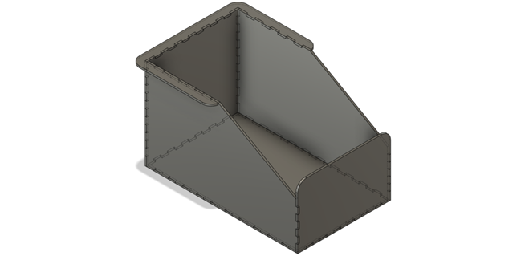

# Looming shadow box

Box for the Looming Shadow experiment where a computer monitor projects shapes from the top of a box.

Animating dark oval shapes above the chamber can elicit flight and freezing responses in mice:
- [Paraventricular nucleus CRH neurons encode
stress controllability and regulate defensive
behavior selection](https://www.nature.com/articles/s41593-020-0591-0)
- [Visual-looming Shadow Task with in-vivo Calcium Activity Monitoring to Assess Defensive Behaviors in Mice](https://en.bio-protocol.org/en/bpdetail?id=3826)
- [Rapid Innate Defensive Responses of Mice to Looming Visual Stimuli](https://www.sciencedirect.com/science/article/pii/S0960982213009913)

## Dimensions
-	Internal dimensions: 50 x 30 x 30 cm
-	Top length: 24cm + 3cm lip
-	Top width: 30cm + 2 x 3cm lip
-	Front height: 15cm + 5cm lip

## Components
- [6mm opaque white acrylic sheets](https://www.polymershapes.com/product/acrylic/)
- 15 to 17" computer monitor.

## Assembly instructions
- Laser cut the acrylic sheets using the [provided CAD drawings](CAD). Remove protective film.
- Assemble all acrylic parts using painter's tape and apply acrylic cement or 2-part epoxy. Remove painter's tape after drying.

## Usage
- Place the mouse in the cage.
- Place computer monitor on top of the box.
- Run video or animation and record behavior with a camera.

## Version History
### 0.1.1
* 2022-12-09
  - Laser cutting version.
### 0.1.0
* 2022-05-13
  - Initial Release.

## License
© 2022 [Leonardo Molina][Leonardo Molina]

This project is licensed under the [Creative Commons BY-NC-SA 4.0 License](https://creativecommons.org/licenses/by-nc-sa/4.0/).

[Leonardo Molina]: https://github.com/leomol
[LICENSE.md]: LICENSE.md